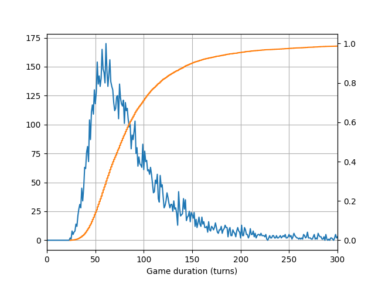

## Monopoly Junior&copy; probabilities

#### Context

Very young kids like to play simple board games. Among them, we can find the "Junior" variant of the classical Monopoly&copy; series. This variant is simplified a lot. In particular the player has no choice in most of its actions, basically reducing the game to a purely random game.

The younger player starts. After playing multiple games with my wife and daughter, I had the impression that my daughter was somehow favored as she won most of the games (while my wife only won a few games and I always lost).

By curiosity, or maybe because I'm a bad looser, I wanted to study the win probabilities of this game as function of the player start order. My initial impression was that the last player only had a low chance to win, since the properties would likely be owner by other players already and instead of acquiring new properties, he would provide funds to the other players such that they can buy even more properties (disclaimer: it does not seem to be that dramatic, see below).

#### Methodology

The logic of the game is implemented in `monopoly_junior_proba.py`. Probably other variants have slightly different rules, one can easily adjust the logic there to match other variants.

Multiple games are simulated to collect `N` samples from this random process. Ignoring what happens to the other players, a given player has a win probability `p`. Sampling from this Bernoulli distribution, one can estimate `p` by computing the sample average, and the (standard) error of this estimate can itself be estimated by `sqrt(p * (1 - p) / N)`. For `N = 10000` samples, the estimated error is 0.5% at most.

#### Results

The plot below gives the win probabilities for a 2-, 3-, and 4-player games, as function of the player start order.

The "fair" game probability is indicated by a grey horizontal line. As suspected, one does see that the earliest a player starts, the higher the chance to win the game. **For the 3-player game, the first player has a win probability of approx. 40% while the last player only wins with approx. 28% probability.**

Another unrelated but interesting question is how long does one game usually lasts? The plot below gives the observed number of games as function of the game duration (and in orange, the corresponding cumulative density function), for the 3-player game.

The typical game duration is ~60 turns. Interestingly, it can happen that games last for an arbitrarily large number of turns. Some games did not finish even after 10000 turns (at this stage, the games were stopped and the winner was the player with the highest balance).

More interesting probabilities can probably be obtained with these samples. I am open to any interesting suggestions, feel free to open an issue for discussion.
